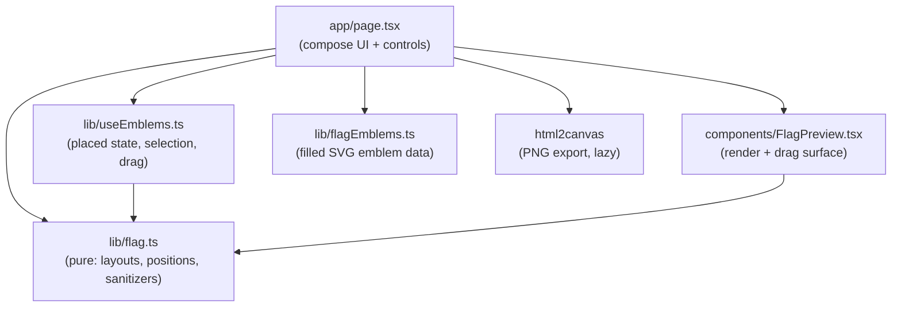

# Country Maker

Design your own country flag in the browser, then download it as a PNG. Built for
kids and hobbyists - pick a layout, set the colors, drop in emblems, drag them where
you want, name your nation.


## Features

- **14 flag layouts** - vertical/horizontal tricolor and bicolor, USA stripes,
  stars + stripes, Nordic cross, X saltire, diagonal split, chevron, Japan sun disc,
  canton + field, quadrants, and solid.
- **Full color control** - 20-swatch flag palette plus per-band custom color pickers.
- **Filled emblems** - dragon, Sol de Mayo sun, Angkor Wat, crescent + star, crown,
  shield, maple leaf, triangle, disc, star, and 16 outline icons. Load any
  [Heroicon](https://heroicons.com) by name too.
- **Place them freely** - tap an emblem to select it (blue ring), then drag it anywhere
  on the flag. Add several, remove one, or clear them all.
- **Text emblems** - type letters or characters (中, 王, USA, ★) straight onto the flag.
- **Name your country** - tap the name under the flag to rename; it is baked into the
  downloaded image.
- **One-tap PNG download** - flag, emblem positions, and country name, up to 3x.

## Stack

Next.js 16 (App Router) · React 19 · Tailwind CSS 3 · Heroicons · html2canvas ·
Vitest + Playwright.

## Architecture

Fully client-side and static - no backend, no runtime env. The page is a thin
composition layer; the flag math is pure and unit-tested, and emblem state lives in a
hook.



- `lib/flag.ts` - pure functions (`buildFlagStyle`, `addEmblemAt`, `moveItem`,
  `upsertText`, `sanitizeFilename`, `sanitizeSvg`). No React - covered by Vitest.
- `lib/useEmblems.ts` - owns placed emblems, selection, and pointer drag.
- `components/FlagPreview.tsx` - presentational render + drag/export surface.
- `next.config.ts` - security headers incl. a strict Content-Security-Policy in prod.

## Develop

```bash
npm install
npm run dev            # http://localhost:3020

npm run typecheck      # tsc --noEmit
npm run lint           # eslint (flat config)
npm test               # vitest unit tests
npm run test:e2e       # playwright end-to-end
```

A Husky pre-push hook runs typecheck + lint + unit tests; GitHub Actions runs the full
gate (typecheck, lint, unit, build, e2e) on every push and PR.

## Deploy

Standalone public app on Vercel, auto-deployed from `main`.
