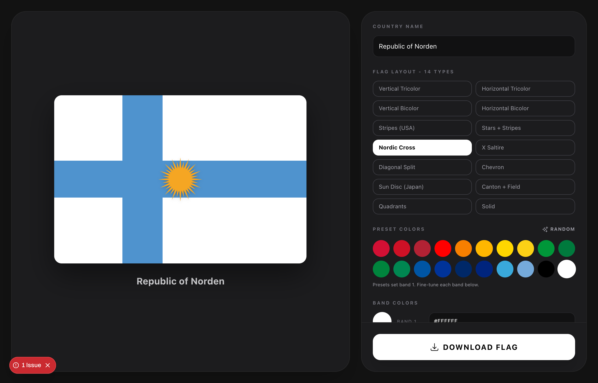

# Country Maker

Design your own country flag in the browser, then download it as a PNG. Built for
kids and hobbyists - pick a layout, set the colors, drop in emblems, name your nation.



## Features

- **14 flag layouts** - vertical/horizontal tricolor and bicolor, USA stripes,
  stars + stripes, Nordic cross, X saltire, diagonal split, chevron, Japan sun disc,
  canton + field, quadrants, and solid.
- **Full color control** - 20-swatch flag palette plus per-band custom color pickers.
- **Filled emblems** - dragon, Sol de Mayo sun, Angkor Wat, crescent + star, crown,
  shield, maple leaf, triangle, disc, star, and 16 outline icons. Load any
  [Heroicon](https://heroicons.com) by name too.
- **Multiple emblems or none** - tap to add/remove several emblems at once, or clear
  them all.
- **Text emblems** - type letters or characters (中, 王, USA, ★) straight onto the flag.
- **Name your country** - shown as a caption and optionally overlaid on the flag.
- **One-tap PNG download** at 3x resolution.

## Stack

Next.js 16 (App Router) · React 19 · Tailwind CSS 3 · Heroicons · html2canvas

## Run locally

```bash
npm install
npm run dev
# http://localhost:3020
```

## Deploy

Deploys to Vercel as a standalone public app.
